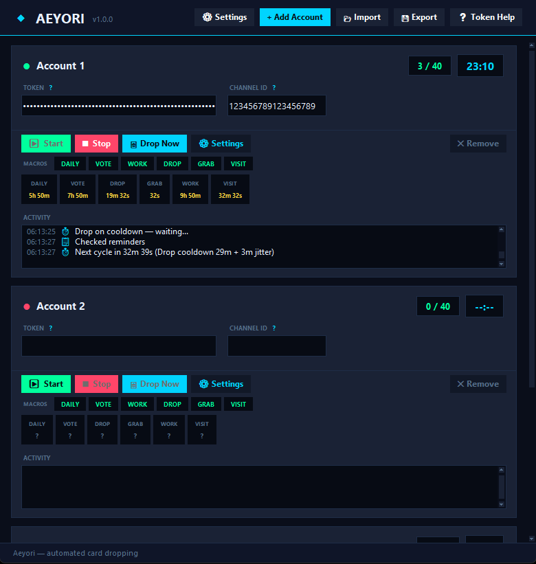

<div align="center">

# Aeyori — Karuta Bot Automation

**Free open source macro for the Discord card game Karuta.**

[**aeyori.com**](https://aeyori.com)

**Karuta macro · Karuta automation · Karuta bot · Karuta Discord bot**

<br />



</div>

---

## What It Does

Aeyori is a Karuta macro that automates the repetitive parts of the game so you can focus on collecting.

- **Auto drop & grab** — drops cards on a timer and grabs any card matching your wishlist using real-time OCR
- **Wishlist detection** — looks up wish counts via `k!lu` and only grabs cards people actually want
- **Auto daily / quiz** — claims your daily reward and answers the quiz automatically
- **Auto work & visit** — runs work and shrine visit commands on cooldown
- **Auto vote** — completes the Karuta voting flow via headless browser
- **Multi-account** — run multiple Discord accounts simultaneously, each with their own settings
- **Burn tagging** — automatically tags low-value cards for burning

---

## Requirements

- Python 3.11 or higher
- Windows recommended (Linux/Mac supported but limited)
- A Discord account that plays Karuta
- Your Discord token (see below)

---

## Installation

**1. Clone the repo**
```bash
git clone https://github.com/0utsights/KarutaBot.git
cd KarutaBot
```
> Note: that's a zero in `0utsights`, not an O.

**2. Create a virtual environment**
```bash
python -m venv venv

# Windows
venv\Scripts\activate

# Linux / Mac
source venv/bin/activate
```

**3. Install dependencies**
```bash
pip install -r requirements.txt
```

> ⚠️ EasyOCR and PyTorch are large installs (~1GB). This will take a few minutes on first run.

**4. Run**
```bash
python KarutaBot/main.py
```

---

## Getting Your Discord Token

Instructions are also available in the app. If you need help, reach out on Discord through my GitHub profile.

1. Open Discord in your **browser** (not the desktop app)
2. Press `F12` to open DevTools → go to the **Network** tab
3. Press `Ctrl+R` to reload the page
4. In the filter box, type `api`
5. Click any request that appears in the list
6. Under **Headers**, find the `authorization` field
7. Copy that value — paste it into the Aeyori token field

---

## Configuration

On first launch a `config.json` is created. You can edit it directly or use the in-app settings panel.

| Setting | Description |
|---|---|
| `token` | Your Discord token |
| `channel_id` | The channel ID where you play Karuta |
| `max_drops` | Max drops per day (default: 40) |
| `vote_mode` | `auto`, `semi`, or `off` |
| `auto_burn` | Automatically burn low-value cards |
| `macros` | Toggle individual automations on/off |

---

## Packaging as a Windows Exe

**1. Install PyInstaller**
```bash
pip install pyinstaller
```

**2. Build**
```bash
pyinstaller --onefile --noconsole --name "Aeyori" --icon=KarutaBot/icon.ico --collect-all easyocr --collect-all torch KarutaBot/launcher.py
```

> ⚠️ Build takes several minutes. Output exe is ~250MB due to PyTorch being bundled. Windows will show a SmartScreen warning on first launch — click **More info → Run anyway**.

**3. Output**
```
dist/Aeyori.exe
```

---

## How the Karuta OCR Works

When Karuta drops cards, Aeyori:

1. Downloads the drop image from Discord
2. Crops each card into name, series, and print number regions
3. Runs EasyOCR to extract text
4. Cleans OCR noise with regex
5. Sends `k!lu <name>` to look up wish counts
6. Fuzzy-matches against the detected series name if multiple results return
7. Grabs the highest-wished card — skips if no wishlist matches

---

## Project Structure

```
KarutaBot/
├── main.py        — entry point
├── gui.py         — main window, account panels, settings
├── bot.py         — Discord automation loop
├── ocr.py         — EasyOCR card image parser
├── vote.py        — Selenium voting automation
├── config.py      — constants, config load/save
├── launcher.py    — PyInstaller entry point
└── icon.ico       — app icon
requirements.txt
```

---

## Want the Managed Version?

[aeyori.com](https://aeyori.com) — pre-packaged Windows exe, user dashboard, no Python setup needed. Free.

---

## Disclaimer

Aeyori automates a user account (selfbot), which is against Discord's Terms of Service. Use at your own risk.
